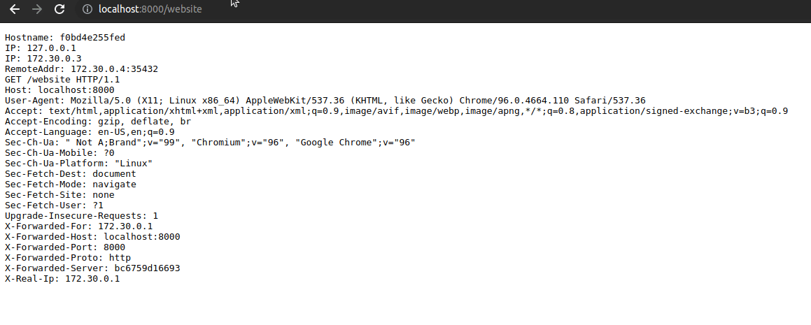

# 🛡️ Traefik ModSecurity Plugin

[](https://github.com/flexys/traefik-modsecurity/actions/workflows/build.yml)
[](https://goreportcard.com/report/github.com/flexys/traefik-modsecurity)
[](https://img.shields.io/github/go-mod/go-version/flexys/traefik-modsecurity)
[](https://github.com/flexys/traefik-modsecurity/releases/latest)
[](LICENSE)

A Traefik plugin that integrates with [OWASP ModSecurity Core Rule Set (CRS)](https://github.com/coreruleset/coreruleset) to provide Web Application Firewall (WAF) protection for your applications.

> [!TIP]
> 
> **Traefik Security**
> 
> The basic middlewares you need to secure your Traefik ingress:
> 
> 🌍 **Geoblock**: [flexys/traefik-geoblock](https://github.com/flexys/traefik-geoblock) - Block or allow requests based on IP geolocation  
> 🛡️ **CrowdSec**: [maxlerebourg/crowdsec-bouncer-traefik-plugin](https://github.com/maxlerebourg/crowdsec-bouncer-traefik-plugin) - Real-time threat intelligence and automated blocking  
> 🔒 **ModSecurity CRS**: [flexys/traefik-modsecurity](https://github.com/flexys/traefik-modsecurity) - Web Application Firewall with OWASP Core Rule Set  
> 🚦 **Ratelimit**: [Traefik Rate Limit](https://doc.traefik.io/traefik/reference/routing-configuration/http/middlewares/ratelimit/) - Control request rates and prevent abuse

> [!WARNING]
>
> **You should not run middlewares as Yaegi plugins in production.**
>
> Traefik's default plugin system runs plugins via [Yaegi](https://github.com/traefik/yaegi) (a Go interpreter) at runtime. Middlewares run on every request, so they sit on the hot path. Using an interpreter for that workload has concrete drawbacks related to memory management, CPU usage and observability (see [feat: improve pprof experience by adding wrappers to interpreted functions by flexys · Pull Request #1712 · traefik/yaegi](https://github.com/traefik/yaegi/pull/1712))
>
> For production deployments where middlewares handle substantial traffic, use a Traefik build that **compiles those middlewares into the binary** instead of loading them as Yaegi plugins such as in [flexys/traefik-with-plugins: Traefik container with preloaded plugins in it](https://github.com/flexys/traefik-with-plugins)
>
> **For more details and discussion, read [Traefik issue #12213](https://github.com/traefik/traefik/issues/12213) in the Traefik issue queue.**

[Traefik ModSecurity Plugin](#-traefik-modsecurity-plugin)

- [Demo](#demo)
- [Usage (docker-compose.yml)](#usage-docker-composeyml)
- [How it works](#how-it-works)
- [Testing](#-testing)
- [Configuration](#️-configuration)
- [Local development](#local-development-docker-composelocalyml)

## Demo

Demo with WAF intercepting relative access in query param.



## Usage (docker-compose.yml)

See [docker-compose.yml](docker-compose.yml)

1. docker-compose up
2. Go to http://localhost/website, the request is received without warnings
3. Go to http://localhost/website?test=../etc, the request is intercepted and returned with 403 Forbidden by
   owasp/modsecurity
4. You can you bypass the WAF and check attacks at http://localhost/bypass?test=../etc

## How it works

This is a very simple plugin that proxies the query to the owasp/modsecurity apache container.

The plugin checks that the response from the waf container hasn't an http code > 400 before forwarding the request to
the real service.

If it is > 400, then the error page is returned instead.

The *dummy* service is created so the waf container forward the request to a service and respond with 200 OK all the
time.

## Testing

### Integration Tests

Run the complete test suite against real Docker services:

```bash
# Run all tests
./Test-Integration.ps1

# Keep services running for debugging
./Test-Integration.ps1 -SkipDockerCleanup
```

**Prerequisites:** Docker, Docker Compose, PowerShell 7+

### Unit Tests

```bash
# Run unit tests
go test -v

# Run with coverage
go test -v -cover
```

### Performance Benchmarks

```bash
# Local benchmarks
go test -bench=. -benchmem

# Integration performance testing
docker compose -f docker-compose.test.yml up -d
go test -bench=BenchmarkProtectedEndpoint -benchmem
```

## ⚙️ Configuration

```yaml
http:
  middlewares:
    waf-middleware:
      plugin:
        modsecurity:
          #-------------------------------
          # Basic Configuration
          #-------------------------------
          modSecurityUrl: "http://modsecurity:80"
          # REQUIRED: URL of the ModSecurity container
          # This is the endpoint where the plugin will forward requests for security analysis
          # Examples:
          # - "http://modsecurity:80" (Docker service name)
          # - "http://localhost:8080" (Local development)
          # - "https://waf.example.com" (External service)
          
          timeoutMillis: 2000
          # OPTIONAL: Timeout in milliseconds for ModSecurity requests
          # Default: 2000ms (2 seconds)
          # This controls how long the plugin waits for ModSecurity to respond
          # Increase for slow ModSecurity instances or large payloads
          # Set to 0 for no timeout (not recommended in production)
          
          unhealthyWafBackOffPeriodSecs: 30
          # OPTIONAL: Backoff period in seconds when ModSecurity is unavailable
          # Default: 0 (return 502 Bad Gateway immediately)
          # When ModSecurity is down, this plugin can temporarily bypass it
          # Set to 0 to disable bypass (always return 502 when WAF is down)
          # Set to 30+ seconds for production environments with automatic failover
          
          modSecurityStatusRequestHeader: "X-Waf-Status"
          # OPTIONAL: Header name to add to requests for logging purposes
          # Default: empty (no header added)
          # This header is added to the REQUEST (not response) for Traefik access logs
          # Header values:
          # - HTTP status code (e.g., "403") when request is blocked by ModSecurity
          # - "unhealthy" when ModSecurity is down and backoff is enabled
          # - "error" when communication with ModSecurity fails
          # - "cannotforward" when request forwarding fails
          # Configure Traefik access logs to capture this header:
          # accesslog.fields.headers.names.X-Waf-Status=keep
          
          #-------------------------------
          # Advanced Transport Configuration
          #-------------------------------
          # These parameters fine-tune HTTP client behavior for high-load scenarios
          # Leave at defaults unless you're experiencing performance issues
          
          maxConnsPerHost: 100
          # OPTIONAL: Maximum concurrent connections per ModSecurity host
          # Default: 0 (unlimited connections)
          # Controls connection pool size to prevent overwhelming ModSecurity
          # Recommended: 50-200 for most environments
          # Set to 0 for unlimited (original behavior)
          
          maxIdleConnsPerHost: 10
          # OPTIONAL: Maximum idle connections to keep per ModSecurity host
          # Default: 0 (unlimited idle connections)
          # Idle connections are kept alive for reuse, reducing connection overhead
          # Recommended: 5-20 for most environments
          # Set to 0 for unlimited (original behavior)
          
          responseHeaderTimeoutMillis: 5000
          # OPTIONAL: Timeout for waiting for response headers from ModSecurity
          # Default: 0 (no timeout)
          # This is different from timeoutMillis - it only waits for headers, not full response
          # Useful for detecting slow ModSecurity instances quickly
          # Set to 0 to disable (original behavior)
          
          expectContinueTimeoutMillis: 1000
          # OPTIONAL: Timeout for Expect: 100-continue handshake
          # Default: 1000ms (1 second)
          # Used when sending large payloads - ModSecurity can reject before full upload
          # Increase for very large files or slow networks
          # This is the only parameter that has a non-zero default
          
          maxBodySizeBytes: 5242880
          # OPTIONAL: Maximum request body size in bytes
          # Default: 5242880 (5 MB)
          # Security feature to prevent DoS attacks via large request bodies
          # Requests exceeding this limit will return HTTP 413 Request Entity Too Large
          # Set to 0 for unlimited (not recommended in production)
          # Common values:
          # - 1048576 (1 MB) for APIs
          # - 5242880 (5 MB) for general use
          # - 10485760 (10 MB) for file uploads
          # - 52428800 (50 MB) for large file processing
          
          ignoreBodyForVerbs: ["HEAD", "GET", "DELETE", "OPTIONS", "TRACE", "CONNECT"]
          # OPTIONAL: HTTP methods for which request body should not be read
          # Default: ["HEAD", "GET", "DELETE", "OPTIONS", "TRACE", "CONNECT"]
          # Performance optimization: skips body reading for methods that don't use it
          # These methods either never have a body or ignore it per HTTP specification
          # 
          # ⚠️  IMPORTANT: When a method is in this list, the request body is COMPLETELY IGNORED
          # and will NOT reach the backend service or next middleware. The body is consumed
          # but not processed, making it unavailable for downstream handlers.
          # 
          # Benefits:
          # - Faster processing for methods that don't need body inspection
          # - Reduced allocations and GC pressure
          # - Body is consumed but not forwarded (saves bandwidth to backend)
          
          ignoreBodyForVerbsDeny: false
          # OPTIONAL: Whether to reject requests with body for verbs in ignoreBodyForVerbs
          # Default: false
          # Security feature: enforces HTTP compliance by rejecting requests that have a body
          # when the HTTP method should not have one according to the specification. It will attempt to 
          # read the first byte of the request body stream to decide.
          # 
          # When enabled (true):
          # - Attempts to read 1 byte from the request body
          # - If any data is found, returns HTTP 400 Bad Request
          # - Prevents malformed requests from reaching the backend
          # - Helps detect potential attacks or misconfigured clients
          # 
          # When disabled (false):
          # - Simply ignores the body without validation
          # - More permissive but less secure
          # - May allow non-compliant requests to pass through
          
          maxBodySizeBytesForPool: 4194304
          # OPTIONAL: Threshold above which to use ad-hoc allocation instead of pool
          # Default: 4194304 (4 MB)
          # Memory optimization: prevents pool pollution with large buffers
          # 
          # How it works:
          # - Checks Content-Length header before reading body
          # - If Content-Length <= threshold: uses pooled bytes.Buffer
          # - If Content-Length > threshold: uses io.ReadAll with ad-hoc allocation
          # - Large requests don't store body to avoid memory issues
          # 
          # Benefits:
          # - Keeps pool efficient for common small requests
          # - Prevents large buffers from staying in pool
          # - Reduces GC pressure from oversized pooled objects
          # - Optimizes memory usage patterns
```


## Local Development

See [docker-compose.local.yml](docker-compose.local.yml) for local development setup.

```bash
# Start development environment
docker-compose -f docker-compose.local.yml up

# Run tests before committing
go test -v && ./Test-Integration.ps1
```
